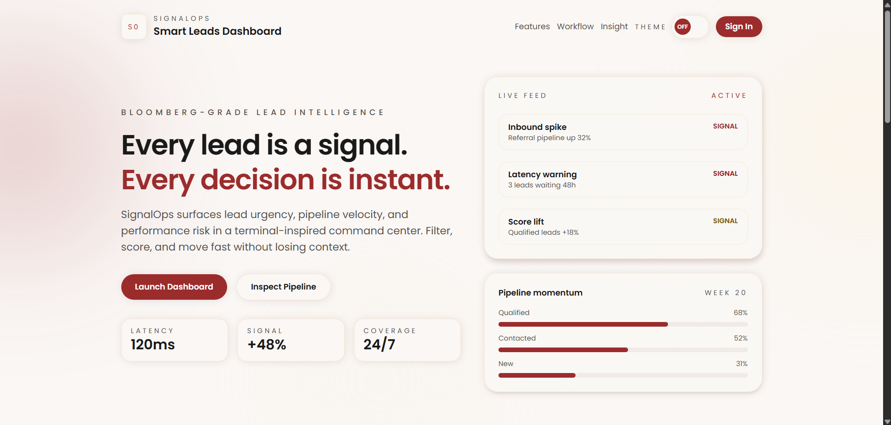
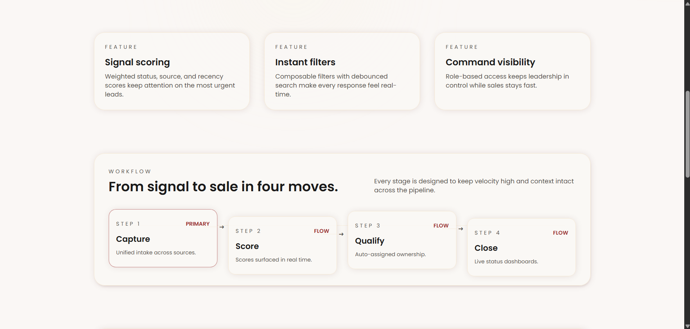
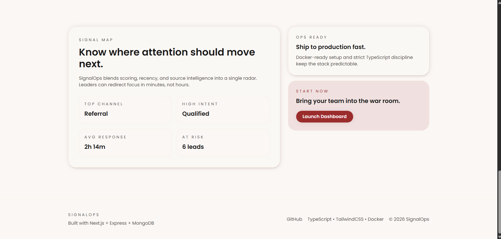
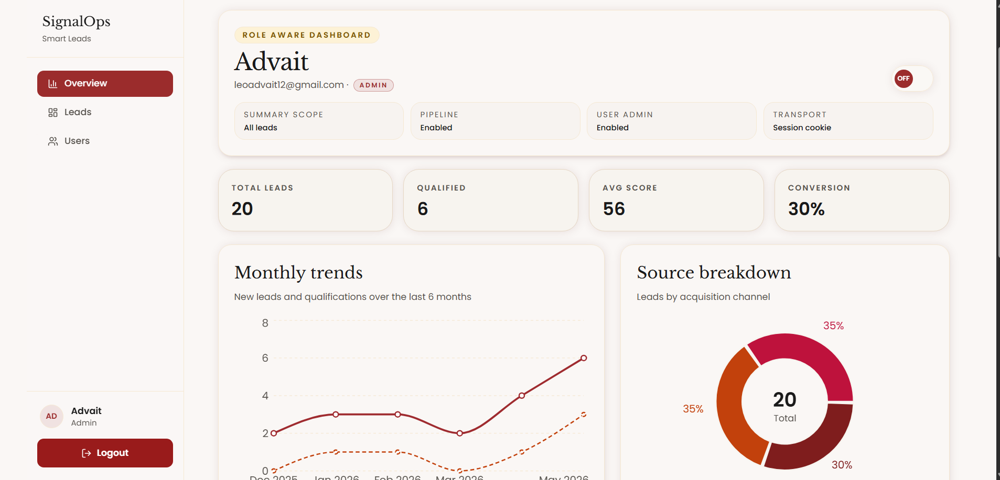
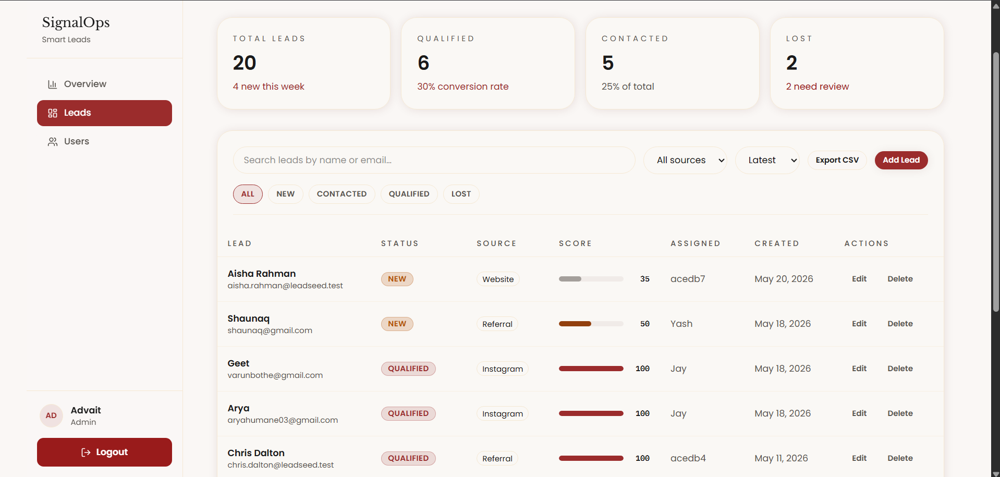
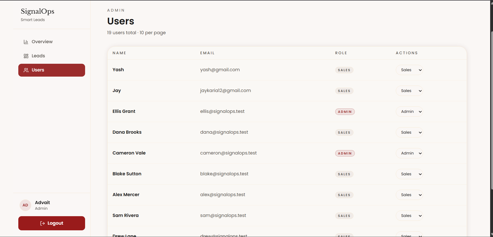

# SignalOps — Smart Leads Dashboard

Full-stack lead management dashboard (MERN + TypeScript) with JWT auth, RBAC, analytics, and a production deployment for review.

## Live deployment

| Service | URL |
|--------|-----|
| **Web app (Vercel)** | https://service-hive-assignment-client-ochre.vercel.app/ |
| **API (Render)** | https://servicehiveassignment-jrc0.onrender.com |
| **API base path** | `https://servicehiveassignment-jrc0.onrender.com/api/v1` |

Open the web app link to sign in. The API health check is available at `/api/v1/health`.

## Demo access (evaluators)

Use these credentials on the [live login page](https://service-hive-assignment-client-ochre.vercel.app/login):

| Field | Value |
|-------|--------|
| **Email** | `ellis@signalops.test` |
| **Password** | `Password1` |
| **Role** | **Admin** — use this account to open **Users** (`/dashboard/users`), export CSV, and manage roles |

Other seeded accounts (if you run `seed:users` locally) also use password `Password1`. Additional admin emails in seed data include `avery@signalops.test` and `cameron@signalops.test`.

## Screenshots

Preview of the deployed UI (images live in `client/public/`):

### Landing & marketing







### Dashboard (admin)







## Features

- JWT auth (register, login, logout, protected routes, httpOnly cookies)
- RBAC (admin / sales)
- Leads CRUD + single-lead detail view
- Advanced filters (status, source, search name/email, sort latest/oldest)
- Debounced search
- Backend pagination with metadata (limit 10)
- CSV export (admin only)
- Analytics + stats endpoints
- Loading, empty, and error states
- Dark mode support

## Tech stack

- **Frontend:** Next.js (App Router), React, TypeScript, Tailwind CSS
- **Backend:** Node.js, Express, TypeScript, MongoDB + Mongoose

## Project structure

- `client` — Next.js UI
- `server` — Express API
- `shared` — Zod schemas used by both client and server

## Local setup

1. Install dependencies:

```bash
npm install
```

2. Configure environment:

- Copy `.env.example` to `server/.env`
- Copy `client/.env.example` to `client/.env.local`
- Set `NEXT_PUBLIC_API_URL=http://localhost:5000/api/v1` in `client/.env.local`

3. Run dev servers (client + server):

```bash
npm run dev
```

Optional seed data:

```bash
npm --workspace server run seed:users
npm --workspace server run seed:leads
```

All seed users use password `Password1`.

## Scripts (root)

- `npm run dev` — start client + server
- `npm run build` — build client + server
- `npm run lint` — lint client + server

## API documentation

See [docs/API.md](./docs/API.md).

## Deployment notes

**Client (Vercel)**

- `NEXT_PUBLIC_API_URL=https://servicehiveassignment-jrc0.onrender.com/api/v1`

**Server (Render)**

- `MONGODB_URI`, `JWT_SECRET` (32+ characters), `CORS_ORIGIN=https://service-hire-assignment-client-ochre.vercel.app` (no trailing slash)
- Production cookies use `SameSite=None` + `Secure` for cross-origin auth between Vercel and Render.

## Notes

- All API responses follow `{ success, data, message, meta? }`.
